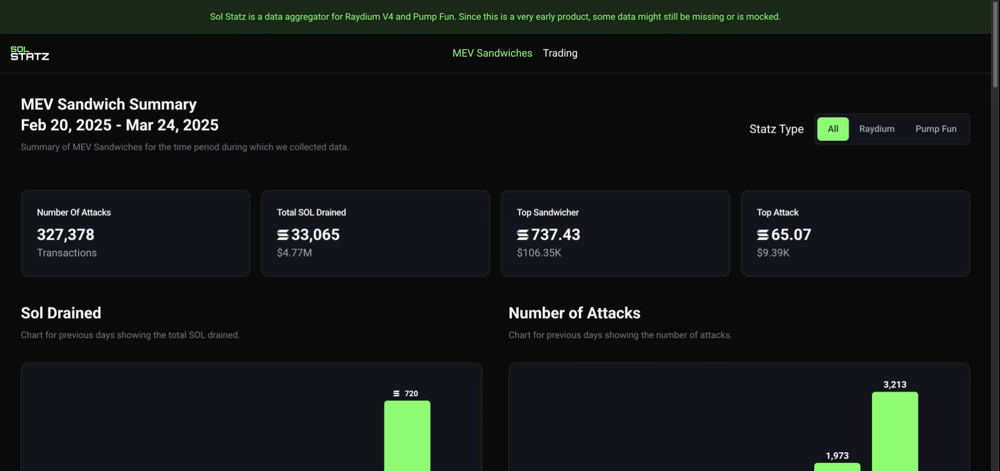
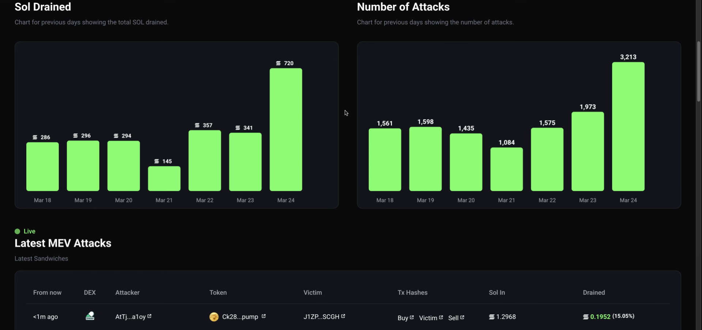
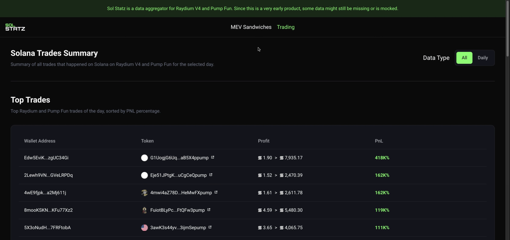
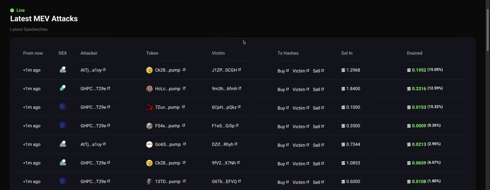

# Sol Statz

> 🚀 **Colosseum accelerator (Solana) - selected as one of ~10 projects worldwide.** Grew into **Tempo**, which raised **$250k**.

**Real onchain data** - MEV sandwich and trading analytics for Raydium V4 and Pump.fun.

## Achievements

- 🚀 **Colosseum accelerator** (Solana) - selected as one of ~10 projects worldwide, became **Tempo** and raised **$250k**
- 🏅 **Superteam Poland Grant** - ~$8,500
- 🏆 **Helius Redacted Hackathon** - won 2 tracks

## The story

It started as a bot. A fully autonomous trading bot on Solana, written in Rust from scratch. It traded **10,000-20,000 tokens a night**, running **10-12 hours completely unattended**, filtering opportunities through **~15 custom filters**, with **sub-0.5ms execution** that landed trades in the same slot as the trigger. It was profitable within the first three weeks.

The kicker: it was my **first ever Rust project**, built with no prior Rust or Solana experience.

To run it, we were indexing every transaction on Raydium V4 and Pump.fun into a Postgres database. At some point it clicked: we were already sitting on all this onchain data, so why not surface it. That became **Sol Statz** - a dashboard exposing MEV sandwich and trading activity that nobody else was showing openly.

Sol Statz was submitted to **Colosseum Eternal**, got picked into the accelerator as one of ~10 teams worldwide, and evolved into **Tempo** (raised $250k).

## What it did

- Live **MEV sandwich** statistics across Raydium V4 and Pump.fun
- Leaderboards: top sandwichers, top traders, biggest attacks
- Per-period summaries of extracted value and attack counts
- Built on a full transaction index of both venues

## By the numbers

- Autonomous bot trading **10,000-20,000 tokens a night**, 10-12h unattended
- **~15 custom filters** driving every trade decision
- **< 0.5 ms** execution, same-slot landing
- Profitable within the **first 3 weeks**
- My **first Rust project** - built with zero prior Rust or Solana experience
- Dashboard indexed **Raydium V4 + Pump.fun** in full (49,186 MEV attacks tracked in one week, Feb 2025)

## Screens

| Dashboard | Attacks & charts |
|---|---|
|  |  |

| Top traders | Latest MEV attacks |
|---|---|
|  |  |

## Tech

- **Bot:** Rust, fully autonomous, tuned for sub-slot execution on Solana
- **Indexer:** custom pipeline ingesting all Raydium V4 + Pump.fun transactions
- **Database:** PostgreSQL
- **Frontend:** Next.js, TypeScript

## My role

Founder. I built the entire frontend, prepared the data layer that fed the indexer, and wrote the whole autonomous trading bot in Rust from scratch.

## Status

Sunset. Source code is kept private - this repo is a case study.
